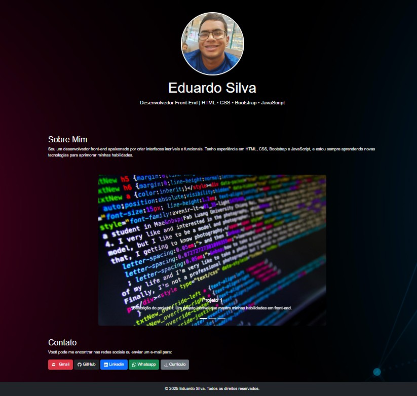

# 💼 Portfólio - Eduardo Silva

Bem-vindo ao meu portfólio online!  
Aqui você encontrará alguns dos meus projetos pessoais e profissionais desenvolvidos com foco em **desenvolvimento web**, **React**, e outras tecnologias modernas.

🌐 Acesse meu portfólio online:  
👉 [eduardoosilva99.github.io/portfolio](https://eduardoosilva99.github.io/portfolio/)

---

## 🧑‍💻 Sobre mim

- 💻 Formado em Sistemas de Informação  
- 📍 Baseado no Brasil  
- 🚀 Apaixonado por desenvolvimento front-end e mobile  
- 📚 Estudando constantemente tecnologias como **React**, **JavaScript**, **TypeScript**, **PHP**, **MySQL**, **Python**, **Java** e **Power BI**

---

## 🛠️ Tecnologias & Ferramentas

- **Front-End**: HTML, CSS, JavaScript, React  
- **Back-End**: PHP, Node.js  
- **Banco de Dados**: MySQL  
- **Ferramentas**: Git, GitHub, VS Code, Figma  
- **Estudando**: Java, Power BI, TypeScript

---

## 📬 Contato

- 📧 Email: **eduardocristoreidudu@gmail.com**  
- 💼 LinkedIn: [linkedin.com/in/eduardo-o-silva-4471aa235](https://www.linkedin.com/in/eduardo-o-silva-4471aa235/)  
- 💻 GitHub: [github.com/eduardoosilva99](https://github.com/eduardoosilva99)

---

## 📸 Prévia

  

---

Obrigado por visitar meu portfólio!  
Se quiser dar sugestões, estou aberto a contribuições ou feedbacks. 🚀
